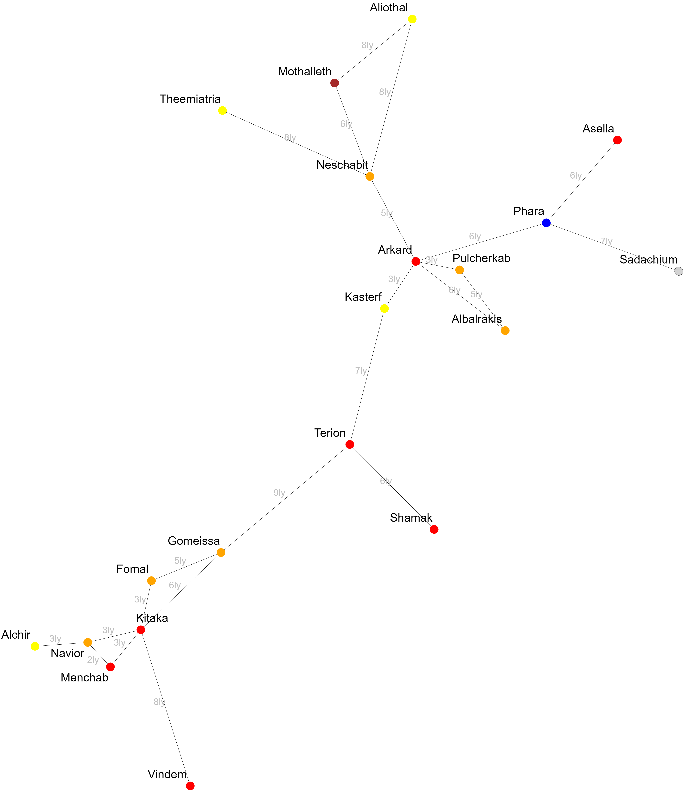

# Zedasich - III.001.079714
Sottosettore della [Galassia del Triangolo](../galassie/galassia-triangolo.md). [Arkad](/wiki/sistemi/arkad.md) è un importante snodo al suo interno.

## Mappa del sottosettore

## Sistemi

- [Arkad](../sistemi/arkad.md)